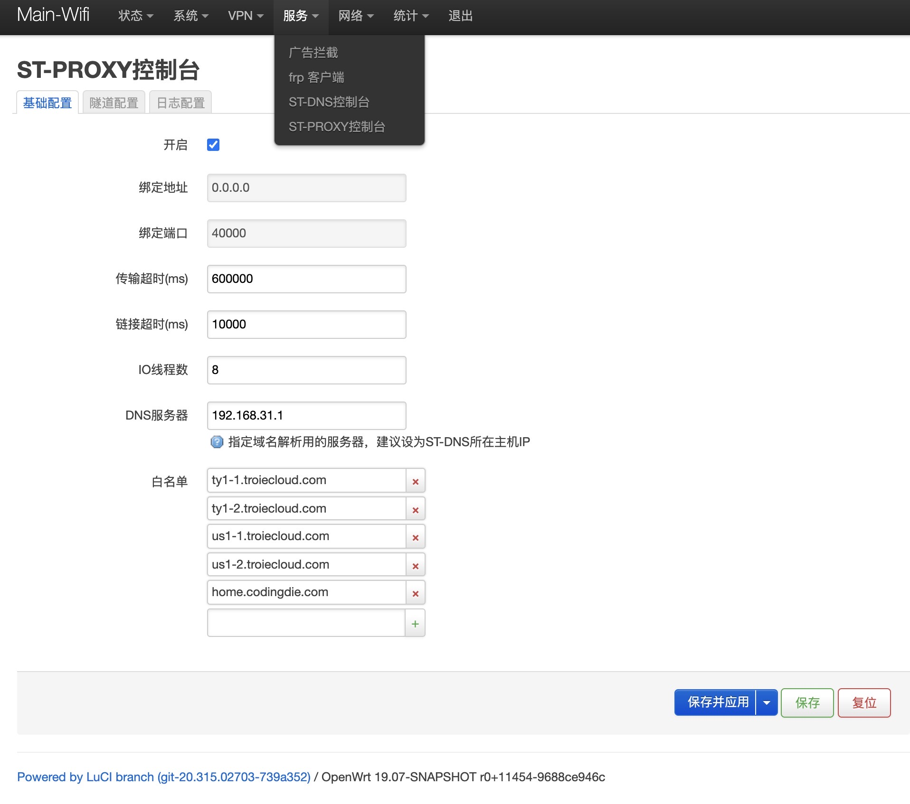

## What is st-proxy?  
st-proxy is a smart local transport proxy which support to config multi socks5/direct stream tunnel chain. every stream tunnel support limit to proxy a specific area tcp session. st-proxy will auto catch all local tcp session and smart choose the best tunnel for stream

### Dependencies
- [CMake](https://cmake.org/) >= 3.7.2
- [Boost](http://www.boost.org/) >= 1.66.0 (system,filesystem,thread)
- [OpenSSL](https://www.openssl.org/) >= 1.1.0
- [ProtoBuf](https://www.openssl.org/) = 3.7.1 

### How to install?  
#### for all platform  
1. download the source code
2. execute ```install.sh```
3. the st-proxy will install to /usr/local/bin, the default configs will install to /usr/local/etc/st/dns   
#### for openwrt 
1. add openwrt feeds https://github.com/codingdie/openwrt-packages
2. choose luci-app-st-proxy and install
3. the app like this

### How to run?  
#### 1. Run Direct  
* `st-proxy`search config in /etc/st/dns or /usr/local/etc/st/dns
* `st-proxy  -c /xxx/xxx`  specific the config folder
#### 2. Run As Service(Recommend)
* `sudo st-proxy -d start`  
* `sudo st-proxy -d stop`  

### How to config?  
```

{
  "ip": "0.0.0.0",  #the local ip
  "port": "40000",  #the local port
  "log": {
    "level": 1,       #0-3 DEBUG/INFO/WARN/ERROR
    "raw_log_server": {  #UDP log server for raw log (optional), recommend logstash to elasticseatch
      "ip": "192.168.31.20",
      "port": 30500,
      "tag": "st-proxy"
    },
    "apm_log_server": {  #UDP log server for apm log (optional), recommend logstash to elasticseatch
      "ip": "192.168.31.20",
      "port": 30501,
      "tag": "st-proxy"
    }
  },
  "tunnels": [
    {
      "type": "DIRECT", #the stream tunnel type DIRECT/SOCKS
      "area": "CN"      #the stream tunnel area
    },
    {
      "type": "SOCKS",
      "ip": "192.168.31.20",
      "port": 1081,
      "area": "JP"
    },
    {
      "type": "SOCKS",
      "ip": "192.168.31.20",
      "port": 1090,
      "area": "US",
      "whitelist": [     #whitelist to prefer use this tunnel
        "xx.tv"
      ]
    }
  ],
  "so_timeout": 600000,     #socket timeout ms (two package max interval)
  "connect_timeout": 10000, #connect timeout ms
    "proxy_target": [
    "all"
  ],
  "parallel": 8,         #io thread num 
  "dns": "192.168.31.1", #prefered dns server, recommend st-dns
  "whitelist": [         #whitelist to not proxy
    "xxx.com"
  ]
}
```

     

